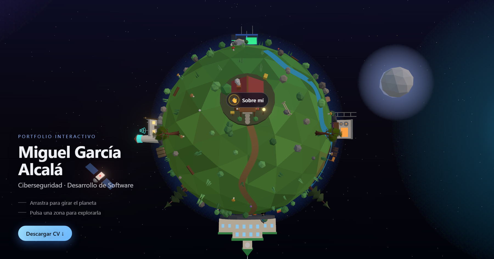

# Portfolio 3D — Miguel García Alcalá

Portfolio personal interactivo presentado como un **planeta low-poly explorable en 3D**. En lugar de una web de scroll convencional, el visitante orbita un pequeño planeta flotando en el espacio y hace clic en sus distintas zonas para que la cámara vuele hacia ellas y revele el contenido del CV.

🌐 **Demo en vivo:** https://portfolio-five-gray-tc7ojy2sqk.vercel.app/



---

## ✨ Sobre el proyecto

El planeta tiene **6 zonas clicables**, cada una con su propia construcción, color y contenido:

| Zona | Contenido |
|------|-----------|
| 👋 **Sobre mí** | Quién soy y qué me motiva |
| 🎓 **Estudios** | Formación académica y certificaciones |
| 💻 **Tecnologías** | Lenguajes y herramientas (ciberseguridad, web, entornos…) |
| 🚀 **Proyectos** | Trabajos destacados con enlaces |
| 💼 **Experiencia** | Recorrido profesional |
| ✉️ **Contacto** | Email, teléfono, LinkedIn, GitHub y CV en PDF |

Al pulsar una zona, la cámara se desplaza para encuadrar su estructura y se abre un panel lateral (un *bottom sheet* arrastrable en móvil) con la información detallada.

## 🛠️ Stack técnico

- **[Angular 20](https://angular.dev/)** — componentes *standalone*, signals y el control de flujo nativo (`@if` / `@for`).
- **[Three.js](https://threejs.org/)** vía `three/webgpu` — render con **WebGPU** y *fallback* automático a **WebGL2**.
- **TSL + PostProcessing** — efecto *bloom* y materiales por shader.
- **[Nx](https://nx.dev/)** monorepo gestionado con **pnpm**.
- **TypeScript** + **SCSS**.
- **Jest** (tests unitarios) y **Playwright** (e2e).

### Detalles de implementación destacables

- **Mundo vivo:** agua animada, vegetación que se mueve, lunas y satélites en órbita, luciérnagas, estrellas fugaces, anillo planetario y un ciclo día/noche sutil.
- **Niveles de calidad adaptativos** (`scene/quality.ts`): la escena detecta el dispositivo y reduce efectos en móviles/equipos modestos (sin *bloom*, menos partículas, pixel ratio limitado) para que el mundo se vea completo y fluido en cualquier sitio.
- **Contenido data-driven:** todo el CV vive en `apps/MyPortfolio/src/app/rooms/rooms.data.ts`, separado de la lógica 3D.
- **Geometría procedural:** las estructuras, carteles y logos de tecnologías se dibujan a partir de primitivas y *canvas* (sin modelos ni logos con copyright).

## 📁 Estructura del repositorio

Monorepo Nx con dos proyectos:

```
apps/
├─ MyPortfolio/          # La aplicación Angular
│  └─ src/app/
│     ├─ scene/          # Motor 3D (scene-engine.ts es el orquestador)
│     │  ├─ structures/  # Construcciones permanentes por zona
│     │  ├─ decorations/ # Vegetación, props y modelos
│     │  └─ details/     # Carteles, logos y contenido al enfocar
│     ├─ rooms/          # Modelo de datos y contenido del CV
│     └─ room-overlay/   # Panel lateral / bottom-sheet de cada zona
└─ MyPortfolio-e2e/      # Suite Playwright
```

## 🚀 Desarrollo

Requisitos: **Node.js** y **pnpm**.

```bash
# Instalar dependencias
pnpm install

# Servir en local (http://localhost:4200)
pnpm exec nx serve MyPortfolio

# Build de producción
pnpm exec nx build MyPortfolio --configuration=production

# Tests unitarios (Jest)
pnpm exec nx test MyPortfolio

# Lint (ESLint)
pnpm exec nx lint MyPortfolio

# Tests e2e (Playwright)
pnpm exec nx e2e MyPortfolio-e2e
```

> El gestor de paquetes es **pnpm** — no uses npm/yarn ni sus lockfiles.

## 📦 Despliegue

Es una **SPA estática**. El *build* genera archivos en `dist/apps/MyPortfolio/browser`, publicables en cualquier hosting de sitios estáticos (Vercel, Netlify, Cloudflare Pages, GitHub Pages…). Está desplegado en Vercel con auto-deploy desde `main`.

Guía completa por proveedor, *fallback* SPA y notas de rendimiento en **[DEPLOY.md](DEPLOY.md)**.

## 📬 Contacto

**Miguel García Alcalá** — Ciberseguridad y Desarrollo de Software

- 📧 mgaralc4@gmail.com
- 💼 [LinkedIn](https://www.linkedin.com/in/miguel-garcia-alcala)
- 🐙 [GitHub](https://github.com/mgaralc)

---

<sub>Hecho con Angular, Three.js y demasiada atención a los detalles. 🪐</sub>
